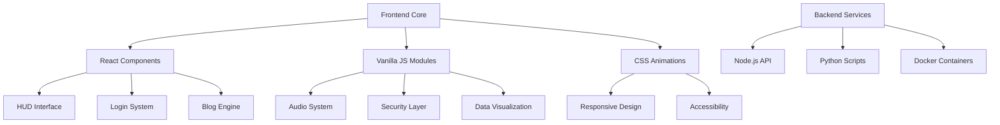

# 🚀 Future Interface Manifesto

> **Plataforma de Interfaces Digitales Avanzadas y Experiencias Inmersivas**

[](https://github.com/Jarmando/githubpagetest/actions)
[](https://www.gnu.org/licenses/gpl-3.0)
[](https://github.com/Jarmando/githubpagetest)
[](https://github.com/Jarmando/githubpagetest/security)
[](https://github.com/Jarmando/githubpagetest/graphs/contributors)

---

## 📋 Tabla de Contenidos

- [🎯 Visión del Proyecto](#-visión-del-proyecto)
- [✨ Características Principales](#-características-principales)
- [🖼️ Demo y Capturas](#️-demo-y-capturas)
- [🏗️ Arquitectura del Sistema](#️-arquitectura-del-sistema)
- [⚡ Instalación Rápida](#-instalación-rápida)
- [🚀 Guía de Uso](#-guía-de-uso)
- [🔧 Configuración Avanzada](#-configuración-avanzada)
- [🤝 Contribución](#-contribución)
- [📈 Roadmap](#-roadmap)
- [📄 Licencia](#-licencia)
- [🙏 Agradecimientos](#-agradecimientos)

---

## 🎯 Visión del Proyecto

**Future Interface Manifesto** es una plataforma integral que trasciende los límites convencionales del desarrollo web frontend. Nuestra misión es crear **interfaces digitales avanzadas y futuristas** que transformen la experiencia del usuario a través de arquitecturas web inmersivas y altamente interactivas.

### 🎨 Especializaciones Core

- **🖥️ HUD (Heads-Up Display) Interfaces:** Sistemas de visualización de datos críticos con capas visuales no intrusivas
- **🎭 UI/UX Avanzados:** Fusión de estética futurista con principios sólidos de usabilidad
- **📊 Visualizaciones de Datos Dinámicas:** Transformación de datos en representaciones visuales impactantes
- **🎵 Efectos Visuales y Sonoros:** Animaciones y paisajes sonoros reactivos que dan vida a la interfaz

---

## ✨ Características Principales

### 🎯 **Experiencias Inmersivas**
- Interfaces HUD con visualización de datos en tiempo real
- Animaciones fluidas y transiciones suaves
- Efectos sonoros reactivos y paisajes sonoros ambientales

### 🔧 **Arquitectura Modular**
- Monorepo con componentes reutilizables
- Sistema de plugins extensible
- Configuración centralizada y gestión de estado avanzada

### 🛡️ **Seguridad y Rendimiento**
- Auditorías de seguridad automatizadas
- Optimización de Core Web Vitals
- Implementación de mejores prácticas de seguridad

### 📱 **Responsive y Accesible**
- Diseño adaptativo para todos los dispositivos
- Cumplimiento de estándares WCAG 2.1
- Navegación por teclado y lectores de pantalla

---

## 🖼️ Demo y Capturas

> **💡 Prueba la demo en vivo:** [https://jarmando.github.io/githubpagetest](https://jarmando.github.io/githubpagetest)

### 🎮 Componentes Interactivos
- **HUD Dashboard:** Visualización de datos en tiempo real
- **React UI Login:** Sistema de autenticación moderno
- **Blog Dinámico:** Gestión de contenido con animaciones
- **Portfolio Inmersivo:** Experiencia de navegación futurista

---

## 🏗️ Arquitectura del Sistema



### 📁 Estructura del Monorepo

```
githubpagetest/
├── 📄 index.html                 # Página principal del portfolio
├── 🎨 src/
│   ├── assets/                   # Recursos estáticos
│   ├── components/               # Componentes React
│   └── js/                      # Módulos JavaScript
├── 🧪 tests/                    # Suite de pruebas
├── 📚 docs/                     # Documentación técnica
├── 🔧 scripts/                  # Scripts de automatización
└── 📦 config/                   # Configuraciones del proyecto
```

---

## ⚡ Instalación Rápida

### 📋 Prerrequisitos

- **Node.js** (v16.0.0 o superior)
- **Python** (v3.8 o superior)
- **Git** (v2.20.0 o superior)
- **Navegador moderno** (Chrome 90+, Firefox 88+, Safari 14+)

### 🚀 Instalación en 3 Pasos

```bash
# 1. Clonar el repositorio
git clone https://github.com/Jarmando/githubpagetest.git
cd githubpagetest

# 2. Instalar dependencias (opcional para vista estática)
npm install

# 3. Abrir en el navegador
open index.html
```

### 🐳 Con Docker (Recomendado)

```bash
# Construir y ejecutar con Docker Compose
docker-compose up -d

# Acceder a la aplicación
open http://localhost:3000
```

---

## 🚀 Guía de Uso

### 🎯 Uso Básico

```bash
# Ver el portfolio principal
open index.html

# Ejecutar componentes React
cd src/components/react-ui-login
npm start
```

### 🔧 Desarrollo Local

```bash
# Instalar dependencias globales
npm install -g live-server

# Servidor de desarrollo
live-server --port=8080

# Ejecutar pruebas
npm test

# Linting y formateo
npm run lint
npm run format
```

### 📊 Monitoreo y Analytics

```bash
# Análisis de rendimiento
npm run analyze

# Auditoría de seguridad
npm run audit

# Generar reporte de cobertura
npm run coverage
```

---

## 🔧 Configuración Avanzada

### 🌍 Variables de Entorno

Crea un archivo `.env` en la raíz del proyecto:

```env
# Configuración de desarrollo
NODE_ENV=development
PORT=3000
API_URL=http://localhost:8000

# Configuración de seguridad
SECURE_COOKIES=true
CSP_ENABLED=true

# Configuración de analytics
GA_TRACKING_ID=GA_MEASUREMENT_ID
```

### ⚙️ Configuración de Build

```json
{
  "scripts": {
    "build": "webpack --mode production",
    "dev": "webpack serve --mode development",
    "test": "jest --coverage",
    "lint": "eslint src/**/*.{js,jsx}",
    "format": "prettier --write src/**/*.{js,jsx,css,html}"
  }
}
```

### 🛡️ Configuración de Seguridad

```javascript
// security-loader.js
const securityConfig = {
  csp: {
    'default-src': ["'self'"],
    'script-src': ["'self'", "'unsafe-inline'"],
    'style-src': ["'self'", "'unsafe-inline'"],
    'img-src': ["'self'", "data:", "https:"]
  },
  headers: {
    'X-Frame-Options': 'DENY',
    'X-Content-Type-Options': 'nosniff',
    'Referrer-Policy': 'strict-origin-when-cross-origin'
  }
};
```

---

## 🤝 Contribución

### 📝 Cómo Contribuir

1. **Fork** el repositorio
2. **Crea** una rama para tu feature (`git checkout -b feature/AmazingFeature`)
3. **Commit** tus cambios (`git commit -m 'Add some AmazingFeature'`)
4. **Push** a la rama (`git push origin feature/AmazingFeature`)
5. **Abre** un Pull Request

### 🎯 Áreas de Contribución

- **🐛 Bug Fixes:** Reporta y corrige errores
- **✨ Nuevas Features:** Implementa funcionalidades innovadoras
- **📚 Documentación:** Mejora la documentación técnica
- **🎨 UI/UX:** Optimiza la experiencia de usuario
- **🧪 Testing:** Añade pruebas unitarias y de integración

### 📋 Estándares de Código

```javascript
// Ejemplo de estándar de código
/**
 * Componente HUD para visualización de datos
 * @param {Object} props - Propiedades del componente
 * @param {Array} props.data - Datos a visualizar
 * @param {Function} props.onUpdate - Callback de actualización
 * @returns {JSX.Element} Componente renderizado
 */
const HUDComponent = ({ data, onUpdate }) => {
  // Implementación del componente
};
```

### 🧪 Testing

```bash
# Ejecutar todas las pruebas
npm test

# Ejecutar pruebas con coverage
npm run test:coverage

# Ejecutar pruebas específicas
npm test -- --grep "HUD"
```

---

## 📈 Roadmap

### 🎯 Q1 2024
- [ ] Implementación de WebGL para visualizaciones 3D
- [ ] Sistema de autenticación biométrica
- [ ] Integración con APIs de IA para personalización

### 🚀 Q2 2024
- [ ] PWA con funcionalidades offline
- [ ] Sistema de analytics avanzado
- [ ] Optimización de Core Web Vitals

### 🔮 Q3 2024
- [ ] Integración con WebAssembly
- [ ] Sistema de microservicios
- [ ] Implementación de WebRTC

### 🌟 Q4 2024
- [ ] Realidad aumentada (AR) en navegador
- [ ] Machine Learning en el frontend
- [ ] Blockchain para autenticación descentralizada

---

## 📄 Licencia

Este proyecto está distribuido bajo la **Licencia Pública General de GNU v3.0**. 

```bash
# Ver la licencia completa
cat LICENSE
```

### 📋 Términos de Uso

- ✅ **Uso comercial permitido**
- ✅ **Modificación permitida**
- ✅ **Distribución permitida**
- ✅ **Uso privado permitido**
- ❌ **Garantía limitada**
- ❌ **Responsabilidad limitada**

---

## 🙏 Agradecimientos

### 🏆 Contribuidores Destacados

- **Jarmando** - Desarrollador principal y arquitecto del sistema
- **Comunidad Open Source** - Librerías y herramientas que hacen posible este proyecto

### 🛠️ Tecnologías y Herramientas

- **Frontend:** React, Three.js, Bootstrap, Vanilla JavaScript
- **Backend:** Node.js, Python, Docker
- **Testing:** Jest, Cypress, Playwright
- **CI/CD:** GitHub Actions, Docker Compose
- **Documentación:** Markdown, Mermaid, JSDoc

### 📚 Recursos y Referencias

- [Documentación de React](https://reactjs.org/docs/)
- [Guía de Three.js](https://threejs.org/docs/)
- [Estándares Web](https://developer.mozilla.org/en-US/docs/Web)
- [Mejores Prácticas de Seguridad](https://owasp.org/www-project-top-ten/)

---

## 📞 Contacto

- **📧 Email:** [jarmando2965@gmail.com](mailto:jarmando2965@gmail.com)
- **🐙 GitHub:** [@Jarmando](https://github.com/Jarmando)
- **💼 LinkedIn:** [Perfil Profesional](https://linkedin.com/in/jarmando)

---

<div align="center">

**🌟 ¡Únete a la revolución de las interfaces del futuro! 🌟**

[](https://github.com/Jarmando/githubpagetest)
[](https://github.com/Jarmando/githubpagetest/fork)

*Forjando realidades digitales con la arquitectura del futuro* 🚀

</div>
